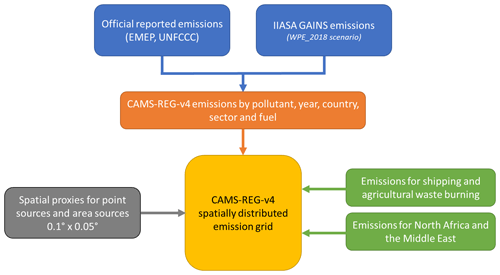
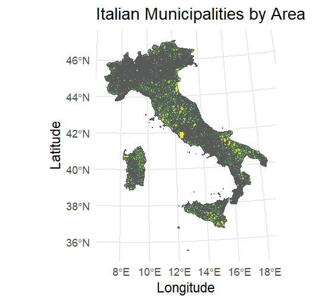

# 🌍 **Italian Emissions Daily Dataset (IEDD)**

## 📜 **Project Overview**
The IEDD project aims to build a comprehensive dataset representing daily emissions in Italian municipalities. The dataset leverages detailed data from the CAMS-REG-ANT datasets and employs CAMS-REG-TEMPO weight factors for accurate temporal distribution.
### 🔍 **Background**
- **CAMS-REG-ANT**: 🌐 Annual emissions data covering key pollutants across Europe, including **NOx**, **SO2**, **NH3**, **CO**, **PM10**, **PM2.5**, **CH4**, **NMVOCs**, and **CO2**. The spatial resolution is **0.05° x 0.1°**. This dataset uses a "top-down" approach, starting from official national inventories and distributing emissions over a spatial grid using auxiliary data (like population density and industrial activity). This ensures consistency with reported data, aiding air quality modeling and policy support. For more details, refer to the [publication](https://essd.copernicus.org/articles/14/491/2022/).

- **CAMS-REG-TEMPO**: 🗓️ This dataset provides temporal profiles that disaggregate annual emissions into finer resolutions (monthly, daily, weekly, hourly). It uses socio-economic, meteorological, and statistical data to model variations across sectors, improving emissions modeling across Europe. For more information, see the [publication](https://essd.copernicus.org/articles/13/367/2021/).

- **CAMS-REG-TEMPO**: 🗓️ This dataset provides temporal profiles that enable the breakdown of annual emissions into finer temporal resolutions (monthly, daily, weekly, and hourly). It incorporates data from diverse sources, including socio-economic and meteorological factors, to model temporal emission variations across sectors like energy, transport, and agriculture. The dataset enhances spatial and temporal detail, supporting accurate air quality modeling across Europe. For more information, refer to the [publication](https://essd.copernicus.org/articles/13/367/2021/).

## 📑 **GNFR Sectors**
The GNFR (Gridded Nomenclature for Reporting) sectors categorize emissions by activity:

- **A Public Power and Heat Production**: 🔋 Emissions from public power, heat, and cogeneration plants.
- **B Industrial Combustion**: 🏭 Emissions from industrial manufacturing combustion.
- **C Other Stationary Combustion**: 🏠 Emissions not covered by public power or industrial combustion.
- **D Fugitive Emissions**: ⛽ From extraction and distribution of fuels.
- **E Solvent and Product Use**: 🧪 Solvents in processes and products.
- **F Road Transport**: 🚗 Road vehicle emissions.
- **G Shipping**: 🚢 Domestic and international shipping emissions.
- **H Aviation**: ✈️ National and international aviation emissions.
- **I Offroad Transport**: 🚜 Vehicles in agriculture and forestry.
- **J Waste Treatment and Disposal**: 🗑️ Emissions from waste processes.
- **K Agriculture**: 🌾 Agricultural production emissions.
- **L Other Agricultural Sources**: 🌳 Emissions not classified above.

## 🛠️ **Methodology**
1. **Annual Data Extraction**: 📥 Retrieve yearly emissions data for Italy from the CAMS-REG-ANT dataset, which uses a top-down approach to distribute national-level emissions across a detailed spatial grid.
2. **Temporal Transformation**: 🗓️ Break down annual emissions into daily estimates using CAMS-REG-TEMPO profiles. These profiles capture variations across different temporal scales (monthly, weekly, daily, and hourly) to provide a more accurate representation of emissions patterns.
3. **Municipality Data Integration**: 🗺️ Align daily emissions data with administrative boundaries of Italian municipalities, ensuring localized analysis.
4. **Dataset Compilation**: 📊 Assemble the final dataset with daily emissions metrics for each municipality, aiding environmental studies and policy-making.

## 📂 **Repository Structure**
- 📁 `/ChangeOfSupport`: Scripts and methodologies for changing the spatial resolution of emissions data from grid cells to municipality boundaries.
- 📁 `/Computation`: Processing and analysis scripts for data transformation.
- 📁 `/Data`: Raw and processed data related to emissions.
- 📁 `/ExtractANT`: Scripts for extracting data from the CAMS-REG-ANT dataset.
- 📁 `/ExtractTEMPO`: Scripts for extracting temporal profiles from the CAMS-REG-TEMPO dataset.
- 📁 `/PlotFunctions`: Functions for generating visualizations of emissions data.
- 📝 `Config`: Configuration file for setting parameters and environment variables.
- 📝 `Utils`: Utility functions and helper scripts for various tasks.
- 📝 `Main`: Main script to orchestrate the data processing workflow.

## 🏆 **Potential Applications**
- **Environmental Impact Assessments**: 🌿 Analyze daily emissions impacts on local/regional environments.
- **Policy Formulation**: 🏛️ Support policymakers in drafting environmental regulations.
- **Public Awareness**: 📢 Increase public awareness of emissions at the municipality level.

## ⚙️ **Usage**
The dataset can be used for environmental studies, policy development, and increasing public awareness. It offers comprehensive insights into temporal emission patterns.

## 📊 **2020 NH3 Emissions in Italy**
Here is the representation of the NH3 emissions in Italy for the year 2020. The map shows the spatial distribution of emissions, highlighting cells with higher concentrations.

# Main characteristics of the CAMS-REG-TEMPOv4.1 dataset

The following table provides an overview of the main characteristics of the CAMS-REG-TEMPOv4.1 dataset, reported by sector and temporal resolution (monthly, daily, weekly, hourly). These profiles are used to model emissions data by sector, pollutant, and spatial scale.

| Sector   | Description                               | Monthly (Σ=12)                        | Daily (Σ=365/366)(1)                  | Weekly (Σ=7)                          | Hourly (Σ=24)                        |
|----------|-------------------------------------------|---------------------------------------|---------------------------------------|---------------------------------------|---------------------------------------|
| GNFR_A   | Public Power                               | Per country, pollutant                | -                                     | Per country, pollutant                | Per country, pollutant               |
| GNFR_B   | Industry                                   | Per country                           | -                                     | -                                     | Fixed(2)                             |
| GNFR_C   | Other stationary combustion                | Per grid cell, pollutant, year        | Per grid cell, pollutant, year        | Per pollutant                        | Per pollutant                        |
| GNFR_D   | Fugitive emissions                         | Fixed(2)                              | -                                     | Fixed(2)                              | Fixed(2)                             |
| GNFR_E   | Solvents                                   | Fixed(2)                              | -                                     | Fixed(2)                              | Fixed(2)                             |
| GNFR_F1  | Road transport exhaust gasoline            | Per year, grid cell for CO and NMVOC; per grid cell for others | -                                     | Per country, day type                 | Per country, day type                |
| GNFR_F2  | Road transport exhaust diesel              | Per year, grid cell for NOx; per grid cell for others | -                                     | Per country, day type                 | Per country, day type                |
| GNFR_F3  | Road transport exhaust LPG                 | Per grid cell                         | -                                     | -                                     | Per country, day type                |
| GNFR_F4  | Road transport non-exhaust (wear and evaporative) | Per grid cell                         | -                                     | -                                     | Fixed for NMVOC                      |
| GNFR_G   | Shipping                                   | Per sea region and pollutant          | -                                     | -                                     | Fixed(2)                             |
| GNFR_H   | Aviation                                   | Per country                           | -                                     | -                                     | Fixed, per pollutant                 |
| GNFR_I   | Off road transport                         | Fixed, per pollutant                  | -                                     | Fixed, per pollutant                  | Fixed, per pollutant                 |
| GNFR_J   | Waste management                           | Fixed(2)                              | -                                     | Fixed(2)                              | Fixed(2)                             |
| GNFR_K   | Agriculture (livestock)                    | Per grid cell, year for NH3 and NOx; fixed for NH3 and NOx | Per grid cell, year for NH3 and NOx   | -                                     | Fixed for pollutant                  |
| GNFR_L   | Agriculture (fertilizers, agricultural waste burning) | Per country for CH4, per grid cell for NH3, others(3) | Per grid cell, year for NH3           | -                                     | Fixed, per pollutant                 |

### Notes:
1. **Leap or non-leap years**: Daily profiles account for the leap year, adjusting the number of days accordingly.
2. **Fixed(2)**: Same profiles as those reported by the TNO dataset (Denier van der Gon et al., 2011).
3. **For CH4**: Same profiles as the ones reported by Crippa et al. (2020).

Source: CAMS261_2022SC1 – Product documentation.

## 🔄 **Change of Support**

The concept of **Change of Support** involves transforming data from one spatial resolution or support (such as a grid of cells) to another (such as administrative boundaries like municipalities). This process is essential when trying to associate gridded data (such as emissions or pollution data) with specific geographic regions that are used in administrative or policy-making contexts.

In this project, we will perform a **change of support** by transitioning data from grid cells (with a resolution of 0.05° x 0.1°) to the boundaries of Italian municipalities. This will allow us to analyze and visualize emissions at a local level, directly linked to municipalities, rather than using arbitrary grid cells.

Below, you can see the two types of spatial resolutions that we will be using in the transformation:

    

        
        
Grid Cell Data
 
    

   

        
        
Municipality Data

    

## 🙌 **Contributing**
Contributions are welcome, such as:
- 🛠️ Improving data extraction/transformation scripts.
- 🔍 Enhancing the dataset with supplementary data.
- 🐞 Reporting and fixing issues with data accuracy.

## 📜 **License**
This project is licensed under the [MIT License](LICENSE).

## Contact
For any queries regarding the project, please reach out to [Project Maintainer's Email].

## Acknowledgements
- [Data Source Providers]
- [Contributors and Collaborators]
